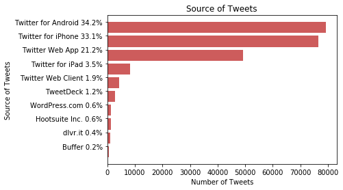
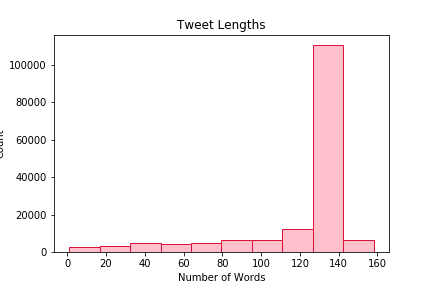
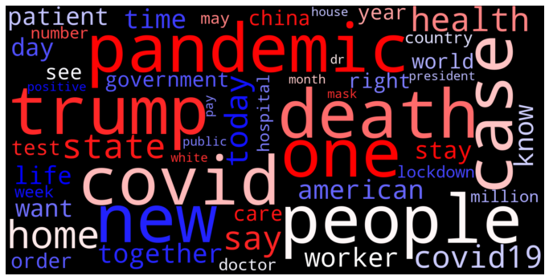
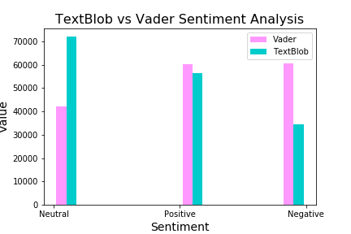
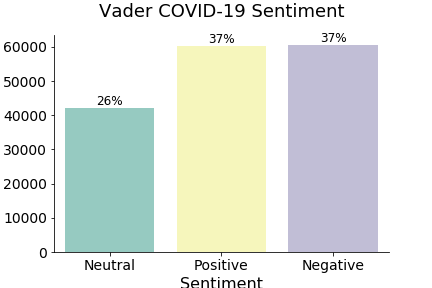
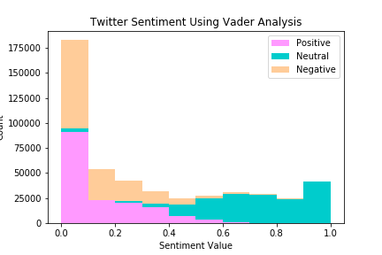
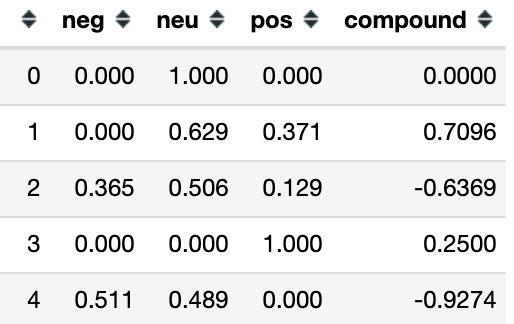
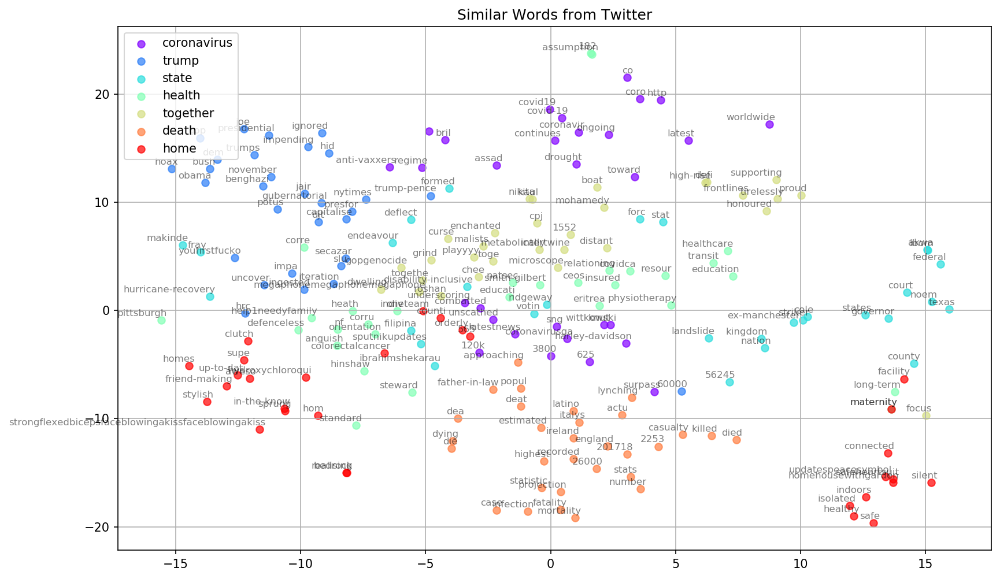

# Twitter Sentiment
<b><center>In the time of the nationwide lock down at the end of April 2020, what are people saying about COVID-19 and the pandemic?</center></b><br>
<br>
In Natural Language Processing (NLP) we map words to vectors containing numeric values so that a machine can understand. We then use these vectors for all type of analysis and predictions. I thoroughly enjoyed this venture into NLP.

# Outline

* Process
* Data
* Data Cleaning
* Sentiment
* Word Associations
* Conclusion
* Recommendations

<h3>Notebooks:</h3>

# Process


* I built a twitter streamer to collect tweets with the filter words: 
    * covid
    * shelter
    * COVID
    * pandemic  

* I collected 231,542 tweets over two days. 
    * I was surprised that it didn't take long - an hour or so each day as I had been warned that twitter could shut down my streamer when collecting so many tweets and tweet collections would be throttled. 

* The general process I used:
    * Set up Twitter OAuthHandler with Tweepy after obtaining the appropriate Twitter permissions and load them
    * Set up a MongoClient to handle the tweets
    * Built a StreamListener to collect the tweets
    * Convert the JSON files from Mongo to dataframes
    * Pickled the dataframe to use in other notebooks

* You'll see a Twitter Streamer copy, since I tried some different things on day 2 but went back to the original plan.

* Began collecting tweets on 4/28/2020 at 1:56 pm continuing off and on for an hour or two and then again on 4/29/2020 finishing up at 1:01 pm.


# The Data

<br><center>Origin of the Tweets - Most tweets originated with a phone or the Twitter Web App.</center>


<br><br><br>

<center>Tweet information - 231,542 tweets with English or Emoji sentiments. English was by far the most prominent language. We are using 68% of the tweets collected.</center>
<br>
<br><br>

<center>Languages Represented - 55 Languages represented plus 1 set of tweets with an unknown language, many of which are emojis or single characters.</center>
<br><br><br>

<center>Top 20 words without filter words</center>
<br><br>

<center>Quintessential word cloud (including the filter words)</center>
<br><br>

Side Note: A few countries withheld tweets -  Turkey, Germany, Indonesia, France, Russian Federation withheld 69 tweets.

# Cleaning Tweets

The cleaning process involved the following:

* Remove @mentions and URLs 
* Removing odd characters
* Convert emojis and emoticons to text
* Convert all words to lowercase
* Remove stopwords
* Strip whitespace
* Word lemmatization
* Remove symbols and numbers
<br><br>

<br><br>


# Sentiment

What do the tweets tell us about the sentiments regarding COVID-19?<br><br>

<center>I began with TextBlob analyzing tweet sentiment but through research learned about VADER Sentiment analysis. If you consider TextBlob sentiment analysis, overall sentiment is neutral to slightly positive, even in this pandemic.</center>
<br>
VADER (Valence Aware Dictionary and sEntiment Reasoner) is a lexicon and rule-based sentiment analysis tool that is specifically designed for sentiments expressed in social media like Twitter. It measures sentiment through positive polarity or negative polarity, and intensity (compound).
<br>
<center>Sentiment, according to VADER seems to be fairly even with positive and negative sentiment.</center><br>



# Word Associations
Use of the gensim library and the two-layer neural network Word2Vec model to find word associations and visualizations.

* Assign similarity value:
    * Medication to hydroxychloroquine - <b>0.41</b>
    * Pandemic to COVID - <b>0.15</b>
* Most similar to:
    * China - <b>CCP, Communist, threatens, Beijing, Chinese</b> 
    * Patient – <b>hospital, hydroxychloroquine, patie, treating, randomized</b>
* Doesn’t belong:
    * Pandemic, health, medication → <b>pandemic</b>
    * People, coronavirus, death → <b>coronavirus</b>
    
 ### Visualization
 

# Conclusion

<b>Overall pandemic sentiment on Twitter seems to be relatively neutral with positive sentiment and negative sentiment equally likely. I like to think that although these are tough times, people want to also find the good in all this craziness.</b>


Personal Note:
* This sentiment analysis project provided practice with nlp allowing interaction with the Twitter API, nltk, TextBlob, gensim and Word2Vec.
* Appreciative of finding different modeling techniques for nlp processing and learning types of models with better predictive values.

# Recommendations

* Phrase analysis with gensim
* Run analysis with less cleaned data
* Run analysis with cleaner data
* Try other models
* Use other word embeddings techniques


```python

```
